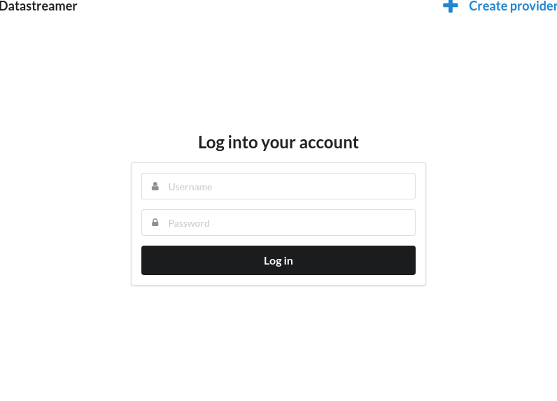
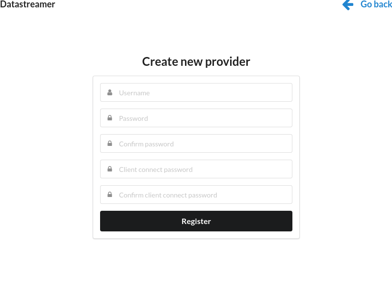
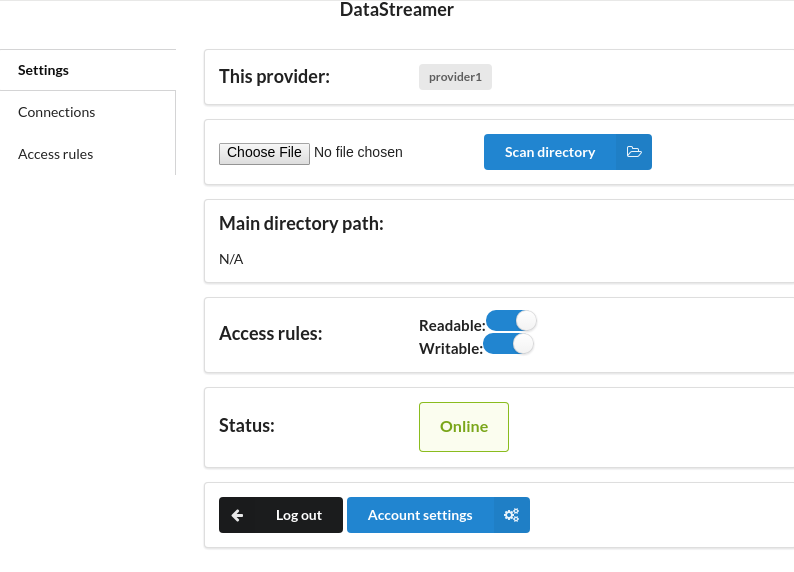

# DataStreamer-Provider

Select the directory you want to be accessible. Manage the connected clients.

Also check out [DataStreamer-Server](https://github.com/hspasov/datastreamer-server).

----

## About

DataStreamer-Provider is a desktop application for providing access to the files in a selected directory and its subdirectories. Clients can connect to a provider and manage the files it gives them access to.

A client can have read only or read and write access.
Read only access allows the connected client to navigate through directories and view their content, download files, view files' metadata and even view images and text files.
Write access provides more options: upload, copy, move, delete files and edit text files.

## Supported platforms

DataStreamer-Provider works on GNU/Linux (x86_64). Support for Windows (32/64 bit), macOS and Linux(x86, armv7l, arm64, mips64el) to be expected in the future.

## Requirements

Debian: `libgconf2-4`

```
$ sudo apt install libgconf2-4
```

## Installation

Download and extract the archive file `datastreamer-provider-linux-x64.zip`, located in `datastreamer-server/bin/`

## Usage

To open the app, launch the executable `datastreamer-provider` from the extracted archive file.

Log into a provider account or create a new one.



Registering a new provider requires chosing a username and two passwords. The first password (just "Password") is used for provider authentication - it is needed when starting the desktop app and logging in. The second one ("Client connect password") is the password the clients connecting to the provider have to type in.



After successful authentication, select the main accessible directory. If necessary, set access rules and manage connected clients. (the default settings for access rules do not allow clients to connect - at least read only access must be providedd)



## Documentation

This is a working product for my graduation thesis for [ELSYS](http://www.elsys-bg.org/). The full documentation can be found [here](https://github.com/hspasov/datastreamer-server/blob/master/doc/Thesis_Remote_file_management_via_P2P_connection.pdf). (in bulgarian)

## Contact

Hristo Spasov - hristo.b.spasov@gmail.com

## License

[MIT](./LICENSE)